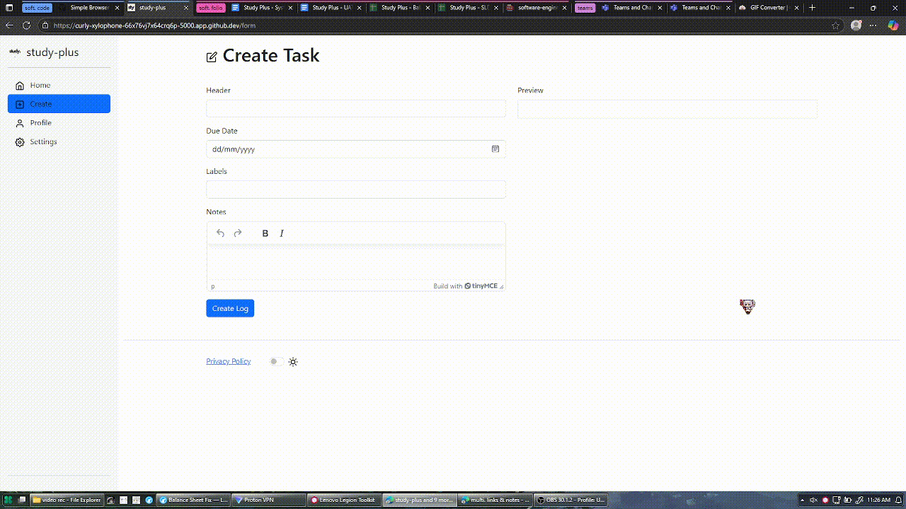
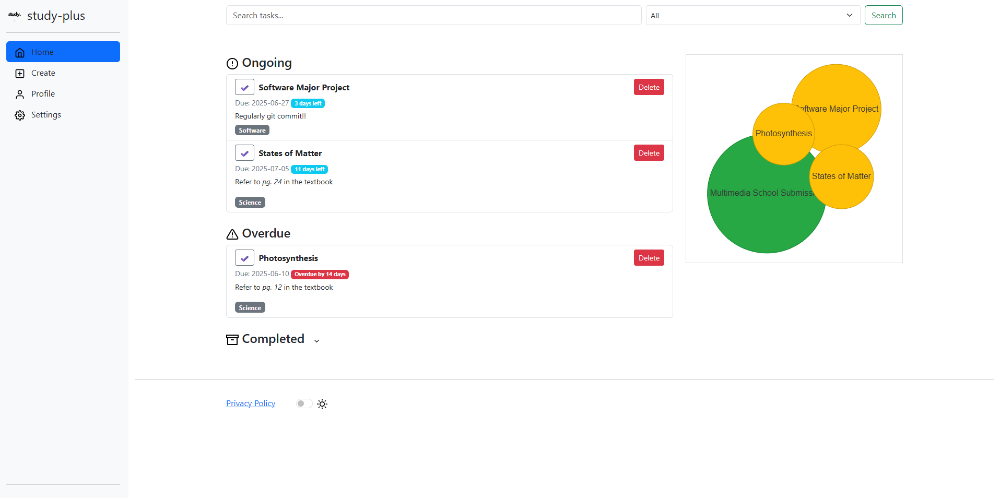
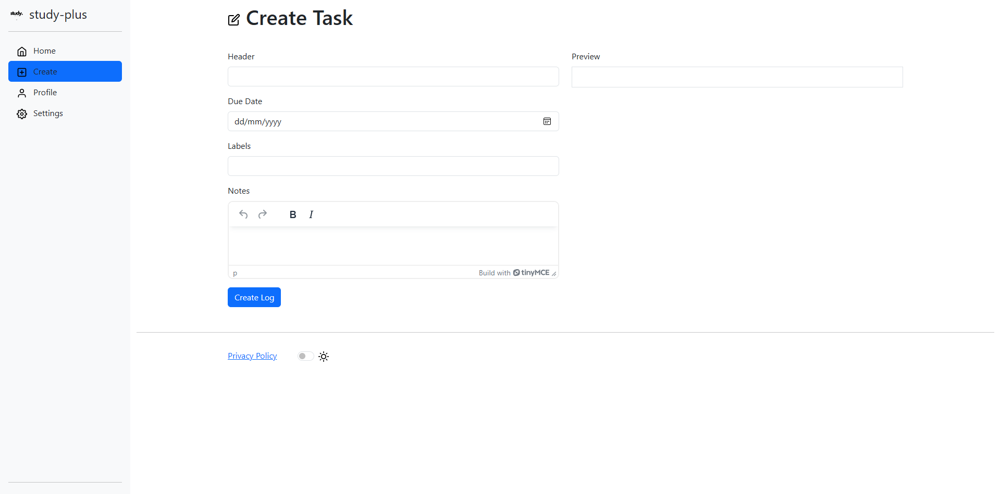
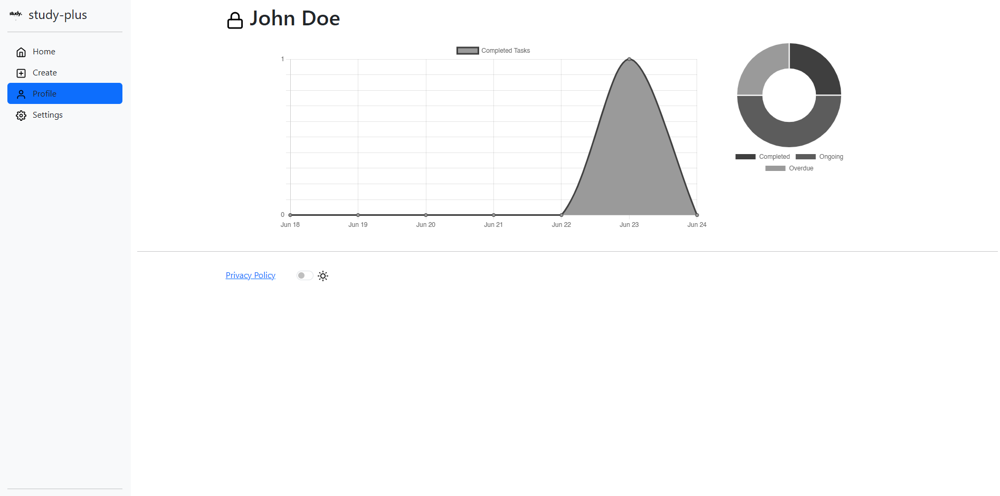
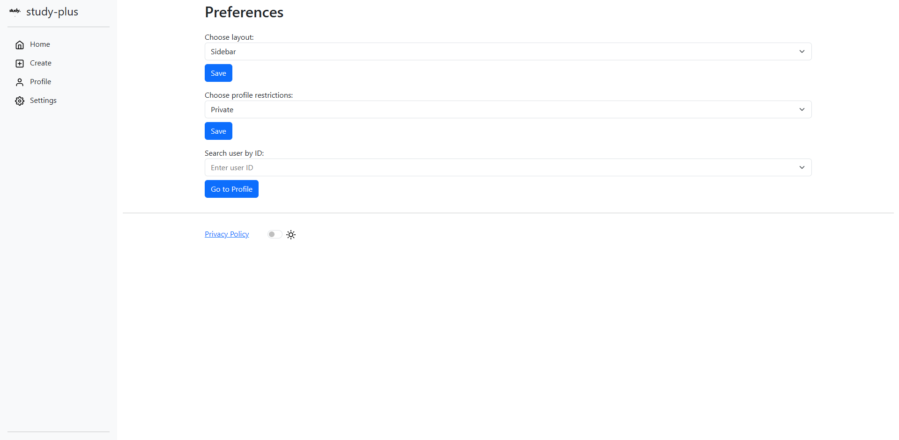

> [!Important]
>
> - For SSL and HTTPS to work, change SSL context from None to Context and allow self-signed certificates (will show up as unsafe)
>

# study-plus
**CONTACT FOR ENQUIRIES: roman.lacbungan@education.nsw.gov.au**

## Overview ##
To track/remind labelled tasks through a node network, improves student wellbeing. An easily accessible app with visual reminders and streaks which motivate users and promote high productivity.

## Main features ##
### Security features
- Strict Content Security Policy
  - No inline ``.
  - Restricted `<iframe>` loading
  - CORS JS blocked
- Automatic account deletion after 6+ months
- Enforces an 8 character minimum password with letters and numbers
- User data can be downloaded and deleted through settings
- Passwords are hashed with randomised cryptography
- Secure session handling with Flask
- Strict input sanitization and validation
- App logging and alerts for suspicious activities
- SSL and HTTPS support (allow self-signed certificates)
### Study features
- Keep track of tasks
- Dark Mode support
- Configurable layout
- Progression chart
- View public profiles

## Installation
1. Clone repository
<pre>git clone https://github.com/TempeHS/2025SE-Roman.L-StudyPlus</pre>

2. Check directory
<pre>cd 2025SE-Roman.L-StudyPlus2025</pre>
   
3. Gather dependencies
<pre>pip install -r requirements.txt</pre>

4. Deploy live server (port: 5000)
<pre>python main.py</pre>

Once deployed, the app can be accessed on either:
- http://localhost:5000
- http://127.0.0.1:5000

## Previous sprints

### [sprint-0.0.1](https://github.com/TempeHS/2025SE-Roman.L-StudyPlus/tree/sprint-0.0.1): June, 2025 - Roman Lacbungan

After my client's feedback through Google Forms and throughout this sprint, I added a node network to better visualise tasks. Additionally, I added a stat chart, a profile page, and properly abstracted my 'main.py' file. Overall, the primary components are working, however I still need to implement better security such as two-factor authentication and other UI and UX enhancements. I disabled my CSP however I still need it for later and my dark mode is not reliable after adding new elements. This particular sprint was quite long, thus future sprints will be minimised.

### [sprint-0.0.2](https://github.com/TempeHS/2025SE-Roman.L-StudyPlus/tree/sprint-0.0.2): June, 2025 - Roman Lacbungan

I focused on improving the user experience by implementing public and private profiles with visible progression tracking. I also overhauled the navbar, and enabled the option of a topbar and sidebar to make navigation more intuitive and user-friendly. Documentation was a key focus as well, and I spent time cleaning it up to make the project easier to understand and contribute to. These changes lay the groundwork for a more scalable and polished interface moving forward. Future sprints will focus on security improvements such as logging the newly added user actions and restoring dark mode.

### [sprint-0.0.3](https://github.com/TempeHS/2025SE-Roman.L-StudyPlus/tree/sprint-0.0.3): June, 2025 - Roman Lacbungan

I focused on code optimisations and security issues. These methods included JS minifcation and lazy loading on images. Since this is my final sprint, I uploaded screenshots and a GIF of the final product. Additionally, clients tested a prototype with a forwarded address which was private to the organisation.

## Examples
### Creating a task

## Screenshots
### Dashboard

### Create

### Profile

### Preferences

## Acknowledgments

Inspiration, code snippets, etc.

* https://github.com/TempeHS/2025SE-Roman.L-HSCTask1
* https://github.com/TempeHS/Secure_Flask_PWA_Template
* https://github.com/makenotion
* https://visjs.github.io/vis-network/docs/network/
* https://www.chartjs.org/docs/latest/charts/line.html
* https://www.chartjs.org/docs/latest/charts/doughnut.html
* https://getbootstrap.com/docs/5.0/examples/sidebars/